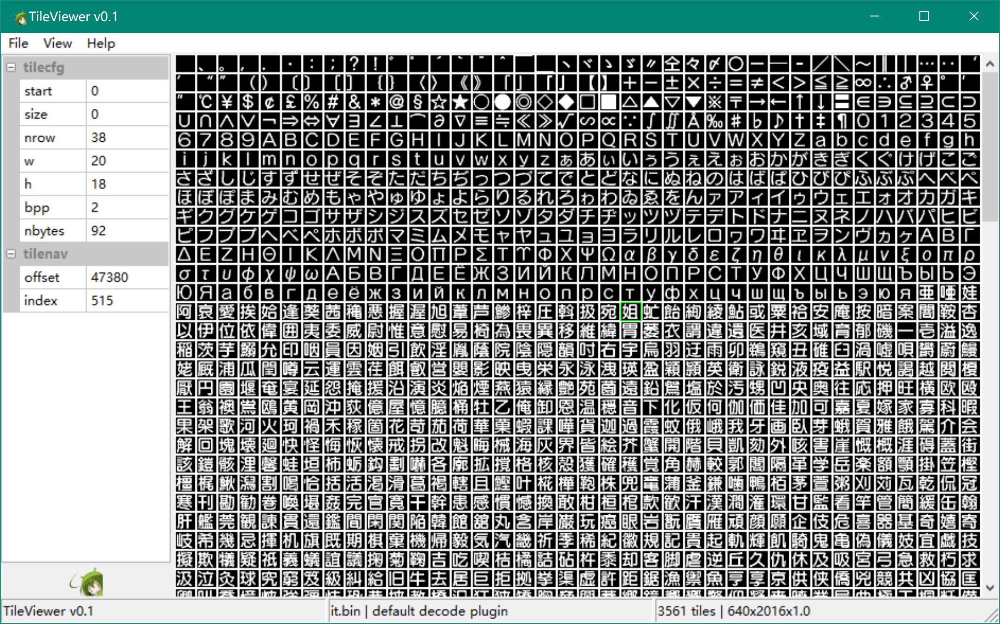
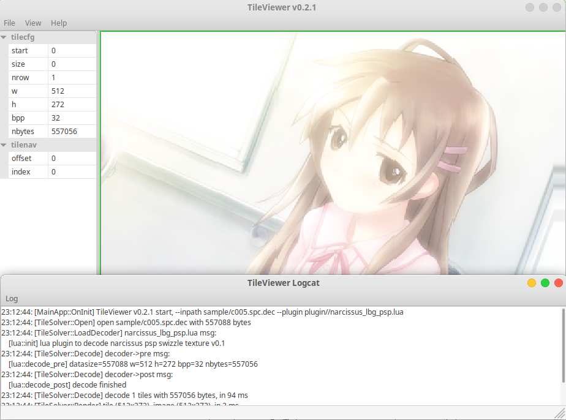

# Tile Viewer

 &style=flat-square) &style=flat-square)

☘️ A cross platform tool to visulize and analyze texture (usually used for console game font) by tiles.  It is inspired by `Crystal Tile 2`, and more flexible with custom lua script or C plugin (for more complex situation, such as swizzle) and command line support.  

Also, it supports for droping file, save decoded image and show cursor moving in tiles.  Futhermore, the window is flexible for changing size and support for zooming in and out with converting the client coordinate to logical coordinate.  

The main purpose is for analyzing game font or textures.  


(example of decoding a 2bpp tile font)

In addition, you can use it for data visulization tool as well.  


(example of data visulization)

## Usage

### (1) gui

It will automaticly search plugins in `./plugin` path. You can use these shortcut to control the view.  

```sh
H|J|K|L cursor moving in tile view
CTRL+O open file
CTRL+L open log window
CTRL+S save decoded tile image
CTRL+B show border in each tile
CTRL++|WHELLUP scale up (zoom in)
CTRL+-|WHELLDOWN scale down (zoom out)
CTRL+R reset scale and fit window to best size
```


(example of view swizzle texture by narcissus psp, using lua plugin)

### (2) cmd

```sh
Usage: TileViewer [-n] [-i <str>] [-o <str>] [-p <str>] 
    [--start <num>] [--size <num>] [--nrow <num>] 
    [--width <num>] [--height <num>] [--bpp <num>] [--nbytes <num>] [-h] [--verbose]
  -n, --nogui         decode tiles without gui
  -i, --inpath=<str>  tile file inpath
  -o, --outpath=<str> outpath for decoded file
  -p, --plugin=<str>  use lua plugin to decode
  --start=<num>       tile start offset
  --size=<num>        whole tile size
  --nrow=<num>        how many tiles in a row
  --width=<num>       tile width
  --height=<num>      tile height
  --bpp=<num>         tile bpp
  --nbytes=<num>      bytes number in a tile
  -h, --help          show this help message
  --verbose           generate verbose log messages
```

command line example

```sh
TileViewer --inpath ../asset/sample/it.bin --width 20 --height 18 --bpp 2 --nbytes 92 --outpath it.png
TileViewer --inpath ../asset/sample/Nobara1.bmp --plugin ../asset/plugin/bmp.lua --outpath Nobara1.png
```


(example of using lua plugin to decode and scale scrolled view)

## Develop

``` mermaid
%%{init: {'theme':'forest'}}%%
graph LR;
m1[core_app]
m2[TileSolver]
c1[core_plugin]
c2[core_decode]
u1[TopFrame]
u2[MainMenuBar]
u3[ConfigWindow]
u4[TileWinodw]
u5[TileView]

m1 --> u1 -- update status bar --> u2 -- load lua plugin--> c1
m1 --> u3 -- set tilecfg|tilenav --> u4
m1 --> u4 -- update tilenav --> u3
u4 -- render tiles --> u5
u5 -- update postion --> u4
u4 -- load and decode--> m2
m2 --> c1
m2 --> c2

```

### (1) Vscode

* c_cpp_properties.json

``` json
{
    "configurations": [
        {
            "name": "Linux x64",
            "includePath": [
                "${workspaceFolder}/src/**", 
                "${workspaceFolder}/build_linux64/**", 
                "${workspaceFolder}/depend/lua-5.4.7/src/**", 
                "${workspaceFolder}/depend/wxWidgets-3.2.6/include"
            ],
            "defines": ["__WXGTK__", "__LINUX__"],
            "compilerPath": "/usr/bin/gcc",
            "cStandard": "c99",
            "cppStandard": "c++11",
            "intelliSenseMode": "linux-gcc-x64"
        }
    ],
    "version": 4
}
```

* launch.json

``` json
{
    "version": "0.2.0",
    "configurations": [
        {
            "name": "Linux x64",
            "type": "cppdbg",
            "request": "launch",
            "program": "${workspaceRoot}/build_linux64/TileViewer",
            "args": ["--inpath", "sample/Nobara1.bmp",  "--width", "20", "--height", "18", "--bpp 2", "--nbytes 92", 
                    "--plugin", "plugin//bmp.lua"],
            "stopAtEntry": false,
            "cwd": "${workspaceRoot}/asset/",
            "environment": [],
            "externalConsole": false,
            "MIMode": "gdb",
            "setupCommands": [
                {
                    "description": "Enable pretty-printing for gdb",
                    "text": "-enable-pretty-printing",
                    "ignoreFailures": true
                },
                {
                    "description": "Set Disassembly Flavor to Intel",
                    "text": "-gdb-set disassembly-flavor intel",
                    "ignoreFailures": true
                }
            ]
        }
    ]
}
```

### (2) C plugin

Implement these function for C decoder plugin, see `src/plugin.h` in detail.  

``` C

struct tile_decoder_t
{
    REQUIRED CB_decode_open open; // open the decoder when loading decoder
    REQUIRED CB_decode_close close; // close the decoder when changing decoder
    REQUIRED CB_decode_pixel decode; // decode each pixel (fill the (i, x, y) pixel)
    OPTIONAL CB_decode_parse pre; // before decoding whole tiles (usually make some tmp values here)
    OPTIONAL CB_decode_parse post; // after decoding whole tiles(usually clean some tmp values here)
    void* context; // opaque pointer for decoder context, user defined struct
    const char *msg; // for passing log informations to log window
};
```

For example, to built plugin `asset/png.c`

``` sh
mkdir -p build_mingw64/plugin
. script/fetch_depend.sh
fetch_stb
gcc -g -Idepend/stb-lastest -Isrc -fPIC -shared asset/plugin/plugin_png.c  -o build_mingw64/plugin/png.dll
```

### (3) Lua plugin

Use `log` to print values in logwindow, implement `decode_pre`,  `decode_pixel` and `decode_post` to decode tiles;
You can use capi functions as below, usually in `decode_pre` to reduce overhead. See `asset/plugin/` in detail.  

Notice that the **lua index is start from 1** !

``` lua
-- c types declear
---@class tilecfg_t
---@field start integer
---@field size integer
---@field nrow integer
---@field w integer
---@field h integer
---@field bpp integer
---@field nbytes integer

-- capis declear 
log = log -- use log(...) to redirect to log window

---@type fun() : tilecfg_t
function get_tilecfg() return {} end -- capi

---@type fun(tilecfg_t)
function set_tilecfg(cfg) end -- capi

---@type fun(): integer
function get_rawsize() return 0 end -- capi

-- get tiles bytes, usually used in decode_pre, and then use this to decode pixel
---@type fun(offset:integer, size: integer): string
function get_rawdata(offset, size) return "" end --capi

-- c callbacks implement
---@type fun() : boolean 
function decode_pre() -- callback for pre process
    -- implement your code here
    return true
end

---@type fun( i: integer, x: integer, y: integer) : integer
function decode_pixel(i, x, y) -- callback for decoding tile i, (x, y) position
    -- implement your code here
end

---@type fun() : boolean 
function decode_post() -- callback for post process
    -- implement your code here
    return true
end
```

## Build

### (1) Windows

install `llvm-mingw` if needed

``` sh
init_mingwsdk() {
    echo "## init_mingwsdk ${MINGWSDK}"
    if ! [ -d ${MINGWSDK} ]; then
        if [ -n "$(uname -a | grep Linux)" ]; then
            curl -fsSL https://github.com/mstorsjo/llvm-mingw/releases/download/20240619/llvm-mingw-20240619-msvcrt-ubuntu-20.04-x86_64.tar.xz -o /tmp/llvm-mingw.tar.xz
            tar xf /tmp/llvm-mingw.tar.xz -C /tmp
            _tmppath=/tmp/llvm-mingw-20240619-msvcrt-ubuntu-20.04-x86_64 
            mv -f ${_tmppath} $MINGWSDK || echo "try to use sudo mv to $MINGWSDK" && sudo mv -f ${_tmppath} $MINGWSDK
            rm -rf /tmp/llvm-mingw.tar.xz
        else
            curl -fsSL https://github.com/mstorsjo/llvm-mingw/releases/download/20240619/llvm-mingw-20240619-msvcrt-x86_64.zip -o ~/llvm-mingw.zip
            7z x ~/llvm-mingw.zip -o$HOME
            mv -f ~/llvm-mingw-20240619-msvcrt-x86_64 $MINGWSDK
            rm -rf ~/llvm-mingw.zip
        fi
    fi
}
```

then fetch depends and build (choose different CC to build x86 or x64)

``` sh
git clone https://github.com/YuriSizuku/TileViewer.git
cd TileViewer

# windows llvm-mingw x64 debug
sh -c "export CC=x86_64-w64-mingw32-clang BUILD_DIR=$(pwd)/build_mingw64 BUILD_TYPE=Debug && script/build_mingw.sh"

# windows llvm-mingw x86 release
sh -c "export CC=i686-w64-mingw32-clang BUILD_DIR=$(pwd)/build_mingw32 BUILD_TYPE=MinSizeRel && script/build_mingw.sh"

# linux  mingw x64 debug
export CC=x86_64-w64-mingw32-gcc CXX=x86_64-w64-mingw32-g++ WINDRES=x86_64-w64-mingw32-windres BUILD_DIR=build_mingw64 && bash script/build_mingw.sh
```

### (2) Linux

install dependencies at first

``` sh
# for general
sudo apt-get -y install build-essential
sudo apt-get -y install p7zip-full git cmake
sudo apt-get -y install libgtk-3-dev

# for cross x86
sudo dpkg --add-architecture i386
sudo apt-get -y update
sudo apt-get -y install gcc-multilib g++-multilib gdb-multiarch
sudo apt-get -y install crossbuild-essential-i386
sudo apt-get -y install libc6:i386 libx11-dev:i386 libxtst-dev:i386 libsm-dev:i386
sudo apt-get -y install libgtk-3-dev:i386 

# for cross armhf
sudo dpkg --add-architecture armhf
sudo apt-get -y update
sudo apt-get -y install crossbuild-essential-armhf
sudo apt-get -y install crossbuild-essential-arm64
sudo apt-get -y install libc6:armhf libx11-dev:armhf libxtst-dev:armhf libsm-dev:armhf
sudo apt-get -y install libgtk-3-dev:armhf 
```

linux local build

``` sh
git clone https://github.com/YuriSizuku/TileViewer.git
cd TileViewer
chmod +x script/*.sh

# linux x64 debug
export CC=x86_64-linux-gnu-gcc CXX=x86_64-linux-gnu-g++ BUILD_DIR=build_linux64 BUILD_TYPE=Debug && bash script/build_linux.sh

# linux x86 debug
export CC=i686-linux-gnu-gcc CXX=i686-linux-gnu-g++ BUILD_DIR=build_linux32 BUILD_TYPE=Debug && bash script/build_linux.sh
```

linux cross build by docker

``` sh
sudo apt-get -y install qemu-user-static binfmt-support

export DOCKER_ARCH=i386 BUILD_DIR=build_linux32_docker BUILD_TYPE=MinSizeRel && bash script/build_docker.sh
export DOCKER_ARCH=x86_64 BUILD_DIR=build_linux64_docker BUILD_TYPE=MinSizeRel && bash script/build_docker.sh
export DOCKER_ARCH=armhf BUILD_DIR=build_linuxa32_docker BUILD_TYPE=MinSizeRel USE_BUILDX=1 && bash script/build_docker.sh
export DOCKER_ARCH=aarch64 BUILD_DIR=build_linuxa64_docker BUILD_TYPE=MinSizeRel USE_BUILDX=1 && bash script/build_docker.sh
```

### (3) macOS
``` sh

# install Xcode Command Line Tools
xcode-select --install

# install Homebrew
/bin/bash -c "$(curl -fsSL https://raw.githubusercontent.com/Homebrew/install/HEAD/install.sh)"

# install dependency using Homebrew
brew install wxwidgets
brew install p7zip
brew install gtk+3
brew install cmake

git clone https://github.com/YuriSizuku/TileViewer.git
cd TileViewer
chmod +x script/*.sh
./script/build_macos.sh

```

## Roadmap

* Core
  * [x] decoder interface with different plugin (builtin, lua, C)
  * [x] plugin built-in decoder, 2|4|8bpp, 16bpp(rgb565), 24bpp(rgb888), 32bpp(rgba8888) ([v0.1](https://github.com/YuriSizuku/TileViewer/releases/tag/v0.2))
  * [x] plugin lua decoder api implement ([v0.2](https://github.com/YuriSizuku/TileViewer/releases/tag/v0.2))
  * [x] plugin C decoder (dll, implement) ([v0.3](https://github.com/YuriSizuku/TileViewer/releases/tag/v0.3))
  * [ ] multi thread decoding, rendering

* UI
  * [x] start up with hello world, cmake structure for the project  
  * [x] inital layout, left config view, right tile view, top menu, bottom status
  * [x] select and render tiles in real time when format changes
  * [x] scale render tile images (zoom in/out) ([v0.1.5](https://github.com/YuriSizuku/TileViewer/releases/tag/v0.1.2))
  * [ ] color palette load, save editor  (partly sovled by plugin)

* Build
  * [x] redirect log message to log window
  * [x] implement command lines  
  * [x] use github action to auto build ([v0.1](https://github.com/YuriSizuku/TileViewer/releases/tag/v0.1))
  * [x] llvm-mingw compile (x86, x64) ([v0.1](https://github.com/YuriSizuku/TileViewer/releases/tag/v0.1))
  * [x] linux compile (x86, x64) ([v0.1.2](https://github.com/YuriSizuku/TileViewer/releases/tag/v0.1.2))
  * [x] linux cross compile by docker (arm32, arm64) ([v0.1.3](https://github.com/YuriSizuku/TileViewer/releases/tag/v0.1.2))

## Issues

## Credit

[wxWidget](https://www.wxwidgets.org/)  
[Lua](https://www.lua.org/)  
[CrystalTile2](https://www.gamebrew.org/wiki/CrystalTile2)  
