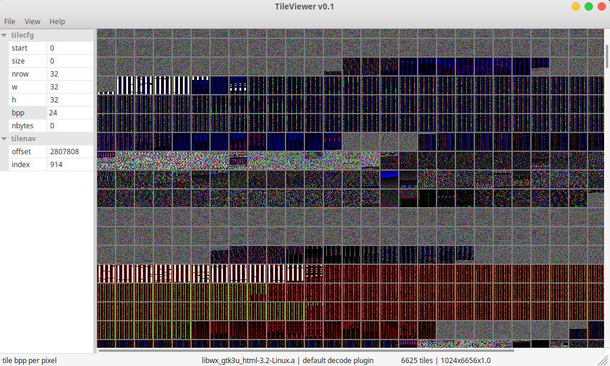
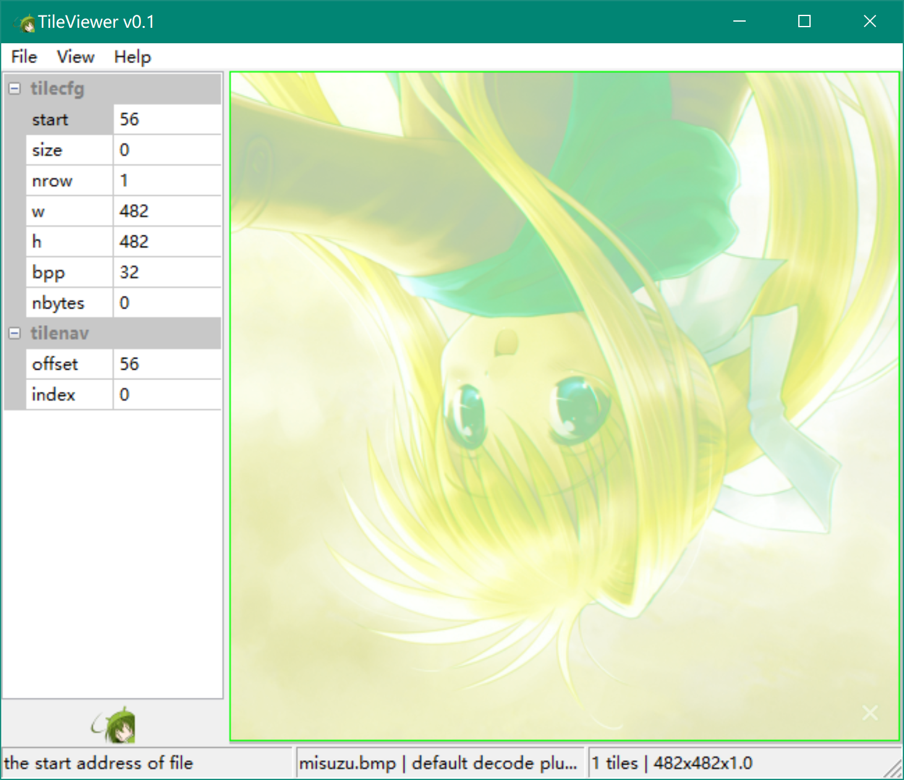

# Tile Viewer

&style=flat-square) &style=flat-square)

☘️ A cross platform tool to visulize and analyze texture (usually used for console game font) by tiles.  It is inspired by `Crystal Tile 2`, and more flexible with custom lua script (for more complex situation, such as swizzle) and command line support.  Also, it supports for droping file, save decoded image and show cursor moving in tiles.  

The main purpose is for analyzing game font or textures.  


(example of decoding a 2bpp tile font)

In addition, you can use it for data visulization tool as well.  


(example of data visulization)

## Usage

### (1) gui

```sh
H|J|K|L cursor moving in tile view
CTRL+O open file
CTRL+L open log window
CTRL+S save decoded tile image
CTRL+B show border in each tile
CTRL++ scale up
CTRL+- scale down
CTRL+R reset scale and fit window to best size
```


(example of view a bmp texture in rgba8888 format)

### (2) cmd

```sh
Usage: TileViewer [-n] [-i <str>] [-o <str>] [-p <str>] 
    [--start <num>] [--size <num>] [--nrow <num>] 
    [--width <num>] [--height <num>] [--bpp <num>] [--nbytes <num>] [-h] [--verbose]
  -n, --nogui         decode tiles without gui
  -i, --inpath=<str>  tile file inpath
  -o, --outpath=<str> outpath for decoded file
  -p, --plugin=<str>  use lua plugin to decode
  --start=<num>       tile start offset
  --size=<num>        whole tile size
  --nrow=<num>        how many tiles in a row
  --width=<num>       tile width
  --height=<num>      tile height
  --bpp=<num>         tile bpp
  --nbytes=<num>      bytes number in a tile
  -h, --help          show this help message
  --verbose           generate verbose log messages
```

command line example

```sh
TileViewer --inpath ../asset/sample/it.bin --width 20 --height 18 --bpp 2 --nbytes 92 --outpath it.png
```

## Develop

``` mermaid
%%{init: {'theme':'forest'}}%%
graph LR;
m1[core_app]
m2[TileSolver]
c1[core_plugin]
c2[core_decode]
u1[TopFrame]
u2[MainMenuBar]
u3[ConfigWindow]
u4[TileWinodw]
u5[TileView]

m1 --> u1 -- update status bar --> u2 -- load lua plugin--> c1
m1 --> u3 -- set tilecfg|tilenav --> u4
m1 --> u4 -- update tilenav --> u3
u4 -- render tiles --> u5
u5 -- update postion --> u4
u4 -- load and decode--> m2
m2 --> c1
m2 --> c2

```

### (1) Vscode

* c_cpp_properties.json

``` json
{
    "configurations": [
        {
            "name": "Linux x64",
            "includePath": [
                "${workspaceFolder}/src/**", 
                "${workspaceFolder}/build_linux64/**", 
                "${workspaceFolder}/depend/lua-5.4.7/src/**", 
                "${workspaceFolder}/depend/wxWidgets-3.2.6/include"
            ],
            "defines": ["__WXGTK__", "__LINUX__"],
            "compilerPath": "/usr/bin/gcc",
            "cStandard": "c99",
            "cppStandard": "c++11",
            "intelliSenseMode": "linux-gcc-x64"
        }
    ],
    "version": 4
}
```

* launch.json

``` json
{
    "version": "0.2.0",
    "configurations": [
        {
            "name": "Linux x64",
            "type": "gdb",
            "request": "launch",
            "arguments": "",  
            "target": "${workspaceRoot}/build_linux64/TileViewer",
            "cwd": "${workspaceRoot}/build_linux64",
            "valuesFormatting": "parseText"
        }
    ]
}
```

### (2) Lua API

## Build

### (1) Windows

install `llvm-mingw` if needed

``` sh
init_mingwsdk() {
    echo "## init_mingwsdk ${MINGWSDK}"
    if ! [ -d ${MINGWSDK} ]; then
        if [ -n "$(uname -a | grep Linux)" ]; then
            curl -fsSL https://github.com/mstorsjo/llvm-mingw/releases/download/20240619/llvm-mingw-20240619-msvcrt-ubuntu-20.04-x86_64.tar.xz -o /tmp/llvm-mingw.tar.xz
            tar xf /tmp/llvm-mingw.tar.xz -C /tmp
            _tmppath=/tmp/llvm-mingw-20240619-msvcrt-ubuntu-20.04-x86_64 
            mv -f ${_tmppath} $MINGWSDK || echo "try to use sudo mv to $MINGWSDK" && sudo mv -f ${_tmppath} $MINGWSDK
            rm -rf /tmp/llvm-mingw.tar.xz
        else
            curl -fsSL https://github.com/mstorsjo/llvm-mingw/releases/download/20240619/llvm-mingw-20240619-msvcrt-x86_64.zip -o ~/llvm-mingw.zip
            7z x ~/llvm-mingw.zip -o$HOME
            mv -f ~/llvm-mingw-20240619-msvcrt-x86_64 $MINGWSDK
            rm -rf ~/llvm-mingw.zip
        fi
    fi
}
```

then fetch depends and build (choose different CC to build x86 or x64)

``` sh
git clone https://github.com/YuriSizuku/TileViewer.git
cd TileViewer

# windows llvm-mingw x64 debug
sh -c "export CC=x86_64-w64-mingw32-clang BUILD_DIR=$(pwd)/build_mingw64 BUILD_TYPE=Debug && script/build_mingw.sh"

# windows llvm-mingw x86 release
sh -c "export CC=i686-w64-mingw32-clang BUILD_DIR=$(pwd)/build_mingw32 BUILD_TYPE=MinSizeRel && script/build_mingw.sh"

# linux  mingw x64 debug
export CC=x86_64-w64-mingw32-gcc CXX=x86_64-w64-mingw32-g++ WINDRES=x86_64-w64-mingw32-windres BUILD_DIR=build_mingw64 && bash script/build_mingw.sh
```

### (2) Linux

install dependencies at first

``` sh
# for x86, x64
sudo dpkg --add-architecture i386
sudo apt-get -y update
# sudo apt-get -y install gcc-multilib g++-multilib gdb-multiarch
sudo apt-get -y install crossbuild-essential-i386
sudo apt-get -y install libc6:i386
sudo apt-get -y install libgtk-3-dev:i386
sudo apt-get -y install libgtk-3-dev

# for arm. arm64
sudo dpkg --add-architecture armhf
sudo apt-get -y update
sudo apt-get -y install crossbuild-essential-armhf
sudo apt-get -y install crossbuild-essential-arm64
sudo apt-get -y install libc6:armhf
sudo apt-get -y install libgtk-3-dev:armhf
sudo apt-get -y install libgtk-3-dev 

# for general
sudo apt-get -y install p7zip-full git make cmake
```

then fetch depends and build

``` sh
git clone https://github.com/YuriSizuku/TileViewer.git
cd TileViewer
chmod +x script/*.sh

# linu x64 debug
export CC=x86_64-linux-gnu-gcc CXX=x86_64-linux-gnu-g++ BUILD_DIR=build_linux64 BUILD_TYPE=Debug && ./script/build_linux.sh

# linux x86_release
export CC=i686-linux-gnu-gcc  CXX=i686-linux-gnu-g++ BUILD_DIR=build_linux32 BUILD_TYPE=MinSizeRel && ./script/build_linux.sh
```

## Roadmap

* Core
  * [x] decoder interface with different plugin (builtin, lua)
  * [x] built-in decoder, 2|4|8bpp, 16bpp(rgb565), 24bpp(rgb888), 32bpp(rgba8888)
  * [ ] extern lua decoder api implement

* UI
  * [x] start up with hello world, cmake structure for the project  
  * [x] inital layout, left config view, right tile view, top menu, bottom status
  * [x] select and render tiles in real time when format changes
  * [ ] scale render tile images (zoom in/out)
  * [ ] color palette load, save editor  

* Other
  * [x] redirect log message to log window
  * [x] implement command lines  
  * [x] use github action to auto build  
  * [x] linux support (x86, x64, arm32, arm64)

## Issues

## Credit

[wxWidget](https://www.wxwidgets.org/)  
[Lua](https://www.lua.org/)  
[CrystalTile2](https://www.gamebrew.org/wiki/CrystalTile2)  
